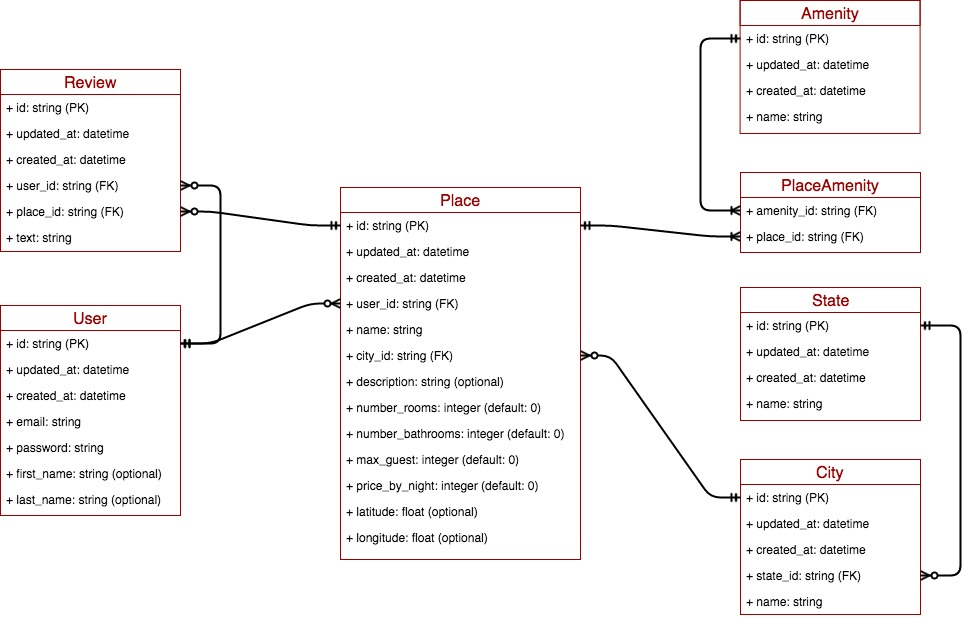

# AirBnB_clone
AirBnB clone built using the Python language and Flask framework as part of the ALX projects

## Project design stages
1. The console project (active-7 days sprint)
2. 

### 1. The Console Project
Deals with serialization/deserialization of Python Object to JSON. The requirements of this module are:
- Data model
- CRUD operation
- Persist to JSON file

#### Quick Start
Run the `console.py` file to use the console terminal and try some CRUD operations, observe the impact on the `file.json` file in the root directory.
> Examples
```bash
(hbnb) help

Documented commands (type help <topic>):
========================================
EOF  all  create  destroy  help  quit  show  update

(hbnb) help all
Prints all string representation of all instances based or not on
        the class name

        Usage: all <class name> or all
        
(hbnb) all
[]
(hbnb) help create
Create a new instance of data models, save it (to the JSON file)
        and print the id

        Usage: create <class name>
        
(hbnb) create User
22926be7-6e91-427d-973a-71a79e8cea7d
(hbnb) all
["[User] (22926be7-6e91-427d-973a-71a79e8cea7d) {'id': '22926be7-6e91-427d-973a-71a79e8cea7d', 'created_at': datetime.datetime(2023, 8, 14, 4, 32, 51, 38740), 'updated_at': datetime.datetime(2023, 8, 14, 4, 32, 51, 38763)}"]
(hbnb) create Place
62d07192-f0ce-406c-bfe6-cb730ae5661b
(hbnb) all
["[User] (22926be7-6e91-427d-973a-71a79e8cea7d) {'id': '22926be7-6e91-427d-973a-71a79e8cea7d', 'created_at': datetime.datetime(2023, 8, 14, 4, 32, 51, 38740), 'updated_at': datetime.datetime(2023, 8, 14, 4, 32, 51, 38763)}", "[Place] (62d07192-f0ce-406c-bfe6-cb730ae5661b) {'id': '62d07192-f0ce-406c-bfe6-cb730ae5661b', 'created_at': datetime.datetime(2023, 8, 14, 4, 33, 4, 881415), 'updated_at': datetime.datetime(2023, 8, 14, 4, 33, 4, 881433)}"]
(hbnb) quit
```
#### Data model


The figure shows the different models needed for the project which are:
- User: the logged-in user of the application
- Review: User's review of the place
- Place: Location to be leased
- City: City where the Place is located
- State: State where the Place is located
- PlaceAmenity: junction or intermediary table to resolve many2many relationships between Place and Amenity
- Amenity: Amenity of a Place (there are many amenities in a place and one amenity to several places)

#### Design Architecture
Uses an OOP class with a class attribute for a couple of reasons:
- easy class identification
- provision of default values
- same behaviour for file storage and database storage


## File structure
- `models` - holds all data models
- `models/engine` - holds all storage classes using the same prototype
- `console.py` - entry file for the console project
- `models/base_model.py` - base model class for all data models
- `tests` - holds all test cases
